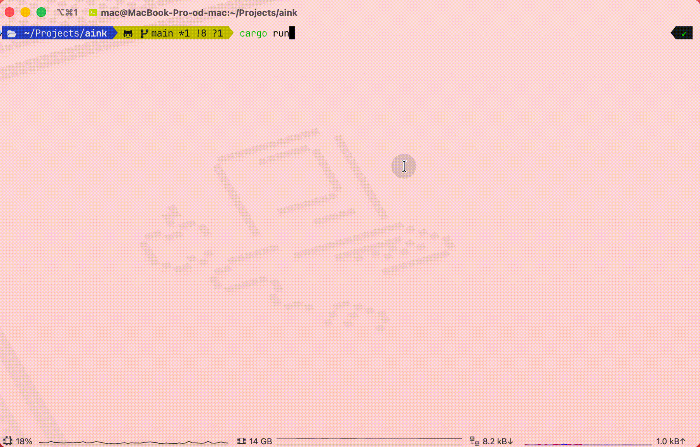

# aink

**追踪与分析 AI 编程工具使用情况。**

[English](README.md)

AINK 是一款功能强大的终端 TUI 应用程序，可从多个来源发现、加载并分析 AI 编程会话记录。追踪 Claude Code、Cursor、Codex、Kiro 等 AI 编程工具的使用情况——监控 token 用量、成本、工具调用、编辑文件以及完整对话历史——全部集中在一个统一界面中。

基于 Rust 和 ratatui 构建，AINK 为希望了解和优化 AI 编程工具使用情况的开发者提供快速、键盘驱动的体验。

---

## 效果展示



---

## 快速开始

### 安装

#### Homebrew

```bash
brew install g-xd/tap/aink
```

### 运行

```bash
aink
```

AINK 会自动发现支持的 AI 编程工具的会话记录。

---

## 功能特点

### 🔍 多数据源会话发现

AINK 自动发现并聚合来自多个 AI 编程工具的会话：

- **Claude Code** — 存储在 `~/.claude/projects` 的会话（来自 API 的原生 token 数）
- **Cursor IDE** — 来自应用程序数据的 Cursor 项目会话记录（通过 tiktoken 计算 token）
- **OpenAI Codex CLI** — Codex 会话数据
- **Kiro** — 存储在 `~/.kiro/sessions` 的会话（通过 tiktoken 计算 token）

每个数据源都可以在 `config.json5` 中单独启用或禁用。AINK 智能地将所有已启用源的会话合并为统一的可排序视图，便于比较不同工具的使用情况。

**Token 计算说明**：Cursor 和 Kiro 的会话数据中不包含原生的 token 数量。AINK 使用 [tiktoken-rs](https://github.com/zurawiki/tiktoken-rs) 库（cl100k_base 编码）从对话文本中计算 token 数。为了提升批量加载性能，Kiro 使用快速的基于字符的估算方法，在详情视图中则使用精确的 tiktoken 计数。

### 📊 会话列表与排序

在综合表格中查看所有 AI 编程会话：

- **丰富的元数据**：项目名、模型、日期、时长、token 数与预估成本
- **灵活排序**：按日期、token、成本或时长排序，快速识别高用量会话
- **可展开行**：按 `→` 展开任意会话，查看每个模型的 token 明细
- **实时刷新**：按 `r` 从磁盘重新加载会话，无需重启
- **时间过滤**：按日期范围过滤会话（今天、最近 7 天、最近 30 天或自定义范围）
- **CLI 过滤**：使用 `--range` 参数启动，立即过滤会话

斑马条纹表格设计配合选择高亮，便于浏览数百个会话。

### 🔎 会话详情

打开任意会话，在三个有序标签页中探索全面的详细信息：

**统计标签**
- 会话元数据：时长、开始时间、轮次数、成本、git 分支、版本
- Token 明细：输入、输出、缓存写入、缓存读取及命中率
- 模型使用：可视化条形图显示各模型的 token 分布
- 工具调用分布：按工具类型的频率和百分比明细

**对话标签**
- 完整的轮次对话历史
- 用户和助手消息，带有清晰的角色指示器
- 工具调用摘要，可展开查看详情
- 可折叠部分，便于管理长对话

**文件标签**
- 会话期间涉及的完整文件列表
- 按目录分组，便于导航
- 树状可视化，带有连接符

使用 `Tab`/`Shift+Tab` 或直接快捷键（`S`、`C`、`F`）在标签页间导航。

### 📤 导出会话

将任意会话导出为 Markdown 格式，便于分享、文档化或归档：

- **一键导出**：在列表视图或详情视图按 `e` 键导出当前会话
- **全面内容**：导出文件包含：
  - 会话元数据（来源、日期、时长、分支、版本）
  - 摘要与统计信息
  - 模型使用明细及 token 数
  - 完整对话历史与工具调用
  - 涉及的完整文件列表
  - 工具调用摘要与分布
- **智能位置**：导出文件保存到最方便的位置：
  1. `./aink-exports/` — 当前工作目录（最易发现）
  2. `~/Documents/aink-exports/` — 当前目录不可写时的备选
  3. 系统数据目录 — 最后备选
- **带时间戳的文件名**：格式 `aink-export-{项目名}-{时间戳}.md` 防止覆盖

导出路径会在成功消息中显示，便于定位导出的文件。

### 💰 成本与用量分析

即时洞察 AI 编程工具的支出和使用模式：

- **单会话成本**：基于公开模型定价的准确成本估算
- **Token 追踪**：分别统计输入和输出 token 数，便于精确分析
  - Claude Code：来自 API 响应的原生 token 数
  - Cursor 和 Kiro：使用 tiktoken-rs（cl100k_base 编码）计算
- **缓存效率**：监控缓存命中率和缓存 token 使用，优化成本
- **模型比较**：查看最常用的模型及其相对成本
- **工具活动**：追踪工具调用频率和文件编辑数量
- **汇总视图**：概览和分析标签提供项目级和工具级摘要

成本估算可通过 `config.json5` 配置，以匹配您的定价层级或自定义费率。由于 Cursor 和 Kiro 会话缺少原生 token 数据，成本是基于 tiktoken 计算的 token 数估算的。

### ⌨️ 键盘驱动的 TUI

专为偏好键盘导航的开发者设计：

- **三个主标签**：概览、会话、分析
- **Vim 风格导航**：`j`/`k` 上下移动，`h`/`l` 展开/折叠
- **快速标签切换**：数字键（`1`、`2`、`3`）或 `Tab`/`Shift+Tab`
- **上下文快捷键**：列表视图和详情视图有不同的按键绑定
- **响应式布局**：适应终端大小，提供宽屏和窄屏布局
- **赛博朋克主题**：深色主题配合强调色、斑马条纹和简洁分隔符
- **可配置**：通过 `config.json5` 自定义快捷键和样式

界面针对速度优化——无需鼠标，无多余动画，只有快速的数据访问。

---

## 架构

AINK 采用模块化架构构建：

- **收集器层**：可插拔的会话记录源（Claude、Cursor、Codex、Kiro），统一解析
- **数据模型**：标准化的 `TranscriptData` 结构，包含每个模型的统计信息和对话历史
- **组件系统**：可重用的 UI 组件（标签、表格、详情视图），具有独立状态
- **基于动作的更新**：使用 tokio 通道的事件驱动架构，支持异步操作
- **主题系统**：集中式样式管理，自动检测深色/浅色模式

代码库遵循 Rust 最佳实践，包含全面的测试，包括对关键功能（如导出文件名生成）的基于属性的测试。

---

## 配置

配置从系统配置目录加载，并与内置默认值合并：

- **macOS：** `~/Library/Application Support/aink/`
- **Linux：** `~/.config/aink/`
- **Windows：** `%APPDATA%/aink/`

通过环境变量覆盖路径：

```bash
AINK_CONFIG=/path/to/config AINK_DATA=/path/to/data aink
```

### 配置示例

多数据源配置示例 `config.json5`：

```json5
{
  "sources": [
    { "kind": "Claude", "root_dir": "~/.claude/projects", "enabled": true },
    { "kind": "Cursor", "root_dir": "~/Library/Application Support/Cursor/User", "enabled": true },
    { "kind": "Codex", "root_dir": "~/.codex/sessions", "enabled": true },
    { "kind": "Kiro", "root_dir": "~/.kiro/sessions", "enabled": true }
  ]
}
```

快捷键与样式可在 `config.json5` 中自定义（首次运行后可在配置目录查看默认配置）。

### 环境变量

| 变量             | 说明               |
|------------------|--------------------|
| `AINK_CONFIG`    | 覆盖配置目录       |
| `AINK_DATA`      | 覆盖数据目录       |
| `AINK_LOG_LEVEL` | 日志级别（默认 `INFO`） |
| `RUST_LOG`       | 另一种日志级别控制 |

日志写入数据目录（如 Linux 下 `~/.local/share/aink/aink.log`）。

## 许可证

本项目采用 [Apache License 2.0](LICENSE) 许可证。
